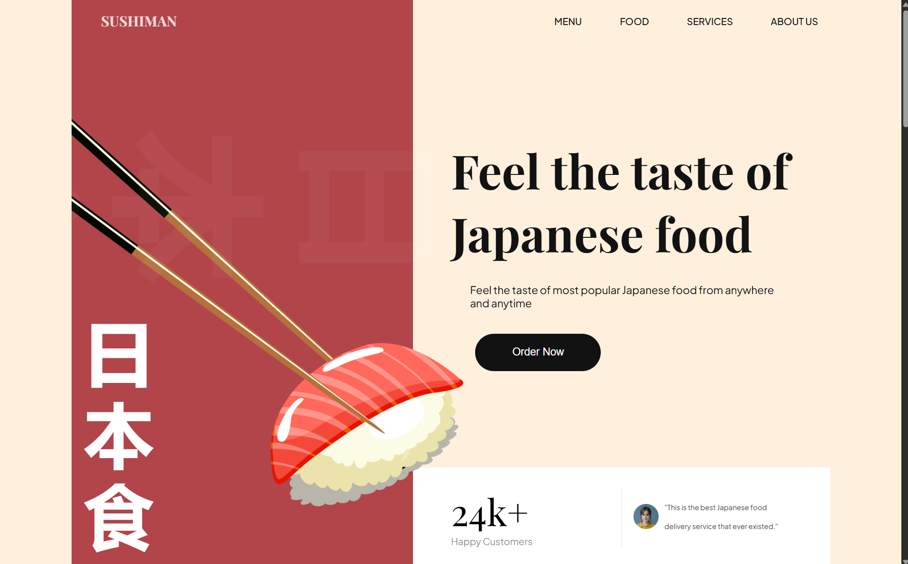
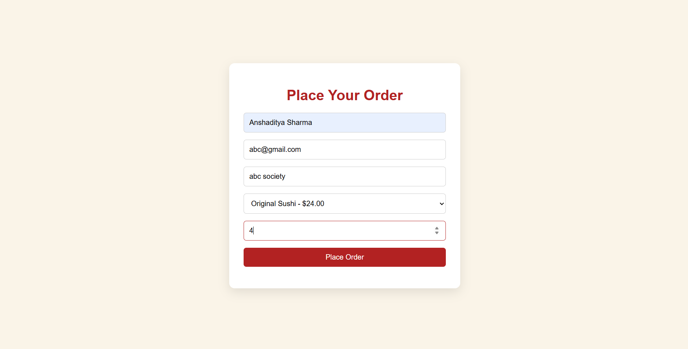
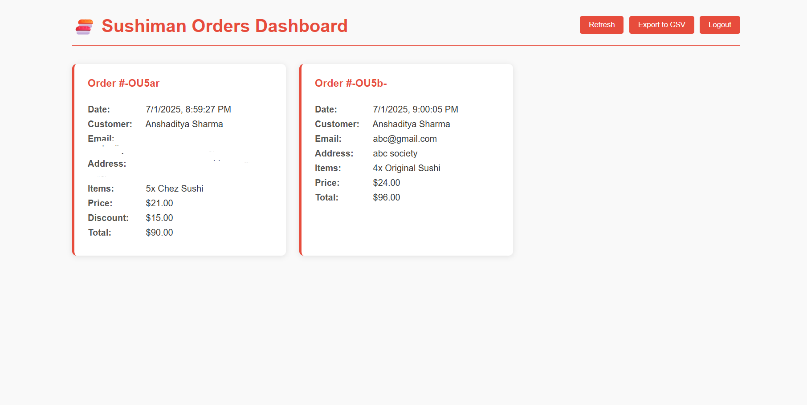

# 🍣 Sushiman - Online Sushi Ordering Website

A visually stunning and interactive sushi ordering website built using **HTML**, **CSS**, **JavaScript**, and **Firebase**. Customers can place orders, and admins can view/manage orders via a protected dashboard.

---

## 🌐 Live Demo

👉 [View the Live Site on Vercel](https://sushistore-lilac.vercel.app/)

---

## 🗂️ Project Structure

SUSHISTORE-FINAL/
├── assets/ # Images & icons
├── CSS/ # All CSS files
│ └── sections/ # Section-wise styles (hero, footer, etc.)
├── js/ # JavaScript logic
│ ├── script.js
│ └── firebase-db.js
├── index.html # Main website
├── order.html # Order form
├── admin.html # Admin dashboard (password protected)
├── .gitignore
├── package.json
└── README.md # You're here

---

## 🔐 Admin Access

The admin dashboard is password protected.

> **Password:** `sushiman123`  
> 🛡️ For demo use only — in production, consider Firebase Authentication or other secure login systems.

---

## 🚀 Features

- 🍱 Place sushi orders with real-time database storage  
- 🔒 Password-protected admin dashboard  
- 📦 Firebase Realtime Database integration  
- 📊 Export orders to CSV  
- 📱 Fully responsive UI across devices  
- 🎨 Aesthetic design with scroll animations (AOS)  
- 💌 Simple newsletter popup interaction  

---

## 🛠️ Technologies Used

- **HTML5**
- **CSS3**
- **JavaScript (Vanilla)**
- **Firebase Realtime Database**
- **AOS (Animate On Scroll)**
- **Vercel** for deployment

---

## 🔄 Deployment & Hosting

This project is live on [Vercel](https://vercel.com).

### To Deploy Your Own Version:

1. Fork or clone the repository  
2. Push to your own GitHub repo  
3. Go to [vercel.com](https://vercel.com) and import the repo  
4. Vercel will auto-detect and deploy `index.html` as the root  
5. Customize your environment, domain, and settings as needed

---

## 📸 Screenshots

